# Marketing Harness Strategy

## Executive summary

Marketing Harness will turn the BB agent orchestration kernel into an agentic marketing workbench. The product should let a user describe a business outcome, then coordinate specialist agents that research, plan, produce, review, publish, measure, and improve a campaign in one auditable workspace.

The product is not primarily a copy generator, social scheduler, design editor, or ad dashboard. Those are capabilities behind a higher-level promise:

> Plan, produce, approve, publish, and learn from one campaign in one auditable workspace.

The long-term vision is broader:

> Own marketing for this launch.

We should reach that vision incrementally. The first milestone must prove a complete organic campaign loop before we add sophisticated creative production, product demos, or paid-media execution.

## Strategic principles

### Keep BB as the orchestration kernel

Retain the parts of BB that already solve difficult agent-platform problems:

- provider-neutral agent sessions
- manager and child-thread delegation
- resumable execution
- append-only thread events
- dynamic tools and skills
- plugin registration and lifecycle
- background services and schedules
- host-local execution
- HTTP, WebSocket, CLI, and SDK surfaces
- interactive approval UI primitives

Build a marketing domain and marketing-specific product surface around that kernel rather than contaminating the runtime with provider or channel logic.

### Separate language generation from deterministic operations

Models already know how to write. Channel-specific writing should primarily live in skills containing examples, constraints, voice guidance, structures, and quality gates.

Use tools for operations that require deterministic behavior, external state, validation, credentials, or side effects.

Skills include:

- campaign planning
- creative briefs
- X posts and threads
- LinkedIn posts
- Instagram captions
- launch announcements
- newsletters
- paid-social copy
- case studies

Tools include:

- brand-context retrieval
- claim validation
- character and placement constraints
- similarity and history searches
- asset rendering
- approval requests
- publication
- analytics retrieval
- campaign mutation
- budget changes

### Make approvals and policy first-class

Every external action must have an explicit risk classification:

1. `READ`
2. `CREATE_DRAFT`
3. `MODIFY`
4. `PUBLISH`
5. `SPEND`
6. `DELETE`

Read and draft actions can usually run autonomously. Publish rules are configurable. Spend and destructive actions start approval-gated.

Approval records must capture:

- the requested action
- the provider and target account
- the exact content or mutation
- expected financial exposure
- start and end times
- policy evaluation results
- the approving user
- timestamps
- execution and reconciliation status

No model should receive unrestricted publishing or advertising-account access.

### Own the canonical data and asset models

Canva, PostBridge, Meta, Google, and rendering engines are adapters, not sources of product truth.

Marketing Harness owns canonical records for brands, campaigns, assets, approvals, publications, experiments, and metrics. Provider identifiers and provider-specific payloads attach to those records through adapters.

### Reuse open source selectively

Do not copy entire applications into the main repository. Use one of four approaches:

1. Import focused libraries normally.
2. Run mature engines behind stable service or plugin interfaces.
3. Maintain a separate fork when deep product-specific changes and upstream history are both important.
4. Study but do not copy projects whose licenses are missing or incompatible.

Every reused project requires license verification, preserved notices, a clear update strategy, and an explicit ownership boundary.

### Prove one closed loop before expanding

The first product loop is:

```text
brand context
  -> campaign plan
  -> channel drafts
  -> human approval
  -> scheduled publication
  -> delivery status
  -> performance snapshot
  -> next recommendation
```

If this workflow is not substantially better than a general-purpose assistant plus a scheduler, adding more creative engines will not create product-market fit.

## Product model

### Brand

The durable identity and operating context for a company or product.

A Brand includes:

- company and product descriptions
- target markets, ICPs, and personas
- offers and value propositions
- differentiators and competitors
- approved and forbidden claims
- founder and brand voice
- visual identity
- source assets
- customer evidence and case studies
- legal and policy constraints
- channel connections
- campaign history
- performance learnings

### Brand Memory

Brand Memory is the compounding knowledge layer. It should distinguish facts from hypotheses and approved policy from generated suggestions.

It stores:

- durable brand facts
- cited research
- user decisions
- approved examples
- rejected content and rejection reasons
- campaign outcomes
- channel and audience learnings
- reusable creative patterns
- confidence, provenance, and freshness metadata

Agents should not silently convert a weak observation into a permanent brand fact. Important memories require provenance and, where appropriate, approval.

## Website-to-outcome onboarding

The default founder experience should begin with the company website rather than an empty assistant. Marketing Harness should use public company evidence to draft a specialized marketing agent, verify that understanding with the founder, produce an ICP, and then work toward a measurable business outcome under explicit approval policy.

This experience may feel similar to the URL-first setup offered by products such as Cossistant or Chatbase, but the output is fundamentally different. Marketing Harness is not merely creating a support chatbot over scraped pages. It is creating a governed marketing knowledge base and a supervised operating agent that can plan campaigns, produce assets, coordinate distribution, and report results.

```mermaid
flowchart LR
    A[Company URL] --> B[Public-source discovery]
    B --> C[Evidence and source snapshots]
    C --> D[Business and brand extraction]
    D --> E[Draft Brand Memory and ICP]
    E --> F[Founder verification]
    F --> G[Approved company model]
    G --> H[Outcome selection]
    H --> I[Campaign planning and production]
    I --> J[Approval packet]
    J --> K[Publishing and measurement]
    K --> L[Reviewed learnings]
    L --> G
```



### Founder experience

The founder's responsibilities should be limited to the decisions where human context and accountability matter most:

- provide the company URL and optional source material
- correct the system's understanding of the business
- identify the most valuable customer and current objective
- confirm which claims are true and publishable
- define deadlines, budgets, channels, and risk constraints
- approve consequential actions

Marketing Harness should handle:

- public research and source collection
- business, product, customer, and brand analysis
- ICP and positioning hypotheses
- campaign planning
- copy and creative production
- channel adaptation and scheduling
- delivery reconciliation
- performance reporting and next-step recommendations

The product should therefore behave like a supervised marketing chief of staff. The founder provides goals, constraints, company truth, and approvals. Marketing Harness performs research, planning, production, coordination, execution, and reporting.

### Step 1: provide the company website

The founder enters a primary company URL. They may optionally add product documentation, sales material, customer research, public social profiles, or files that are not linked from the main website.

The system discovers and prioritizes public sources such as:

- home, about, product, feature, solution, and use-case pages
- pricing, comparison, integration, and partner pages
- customer stories, testimonials, case studies, and review links
- blog, resource, documentation, help, and changelog pages
- careers, press, investor, legal, privacy, and terms pages
- XML sitemaps, page metadata, and structured data
- linked public documents and downloadable assets
- official public social profiles and video channels
- public interviews, podcasts, press coverage, and directory listings

Collection must respect robots.txt, authentication boundaries, provider terms, reasonable rate limits, and deletion requests. The system should never bypass access controls or present private, inferred, or third-party material as company-approved truth.

### Step 2: preserve evidence before interpretation

The ingestion layer should create source snapshots before agents derive conclusions. A snapshot records:

- canonical URL and source type
- retrieval time and content fingerprint
- extracted title, text, metadata, and structured data
- source ownership and first-party or third-party classification
- freshness and accessibility state
- links to any derived observations

Every meaningful conclusion should retain provenance. The product must distinguish four knowledge states:

1. **Observed fact**: directly supported by a cited source.
2. **Reasonable inference**: derived from several observations but not explicitly stated.
3. **Unverified hypothesis**: useful for planning but awaiting confirmation or evidence.
4. **Founder-approved truth**: explicitly confirmed for use in marketing operations.

Conflicting sources should remain visible rather than being silently reconciled. The newest page is not automatically the most authoritative page, and third-party claims should not override first-party policy without review.

### Step 3: draft the company model

The Research Agent converts source evidence into a structured draft covering:

- company description, category, stage, and business model
- products, plans, features, integrations, and pricing
- problems solved and customer outcomes promised
- target markets, industries, geographies, and company sizes
- existing positioning, value propositions, and differentiators
- direct competitors, indirect alternatives, and the status quo
- proof points, testimonials, customers, case studies, and quantified claims
- acquisition calls to action and existing conversion paths
- legal, regulatory, policy, and brand constraints
- public channel presence and observed publishing patterns

The extraction process should also identify contradictions, missing evidence, stale pages, and unsupported claims. These become verification questions rather than hidden uncertainties.

### Step 4: infer brand voice

The system drafts a voice profile from representative first-party writing. It should analyze:

- vocabulary and recurring phrases
- sentence length and structural rhythm
- level of formality and technical depth
- use of humor, urgency, emotion, and metaphor
- preferred perspective, such as founder-led, company-led, or customer-led
- headline, call-to-action, and social-post patterns
- words, claims, topics, and tones to avoid
- differences between company, founder, product, and support voices

The voice profile should include citations and representative examples. Frequency alone does not imply preference. A phrase copied across SEO templates may be less meaningful than a founder letter or carefully written product page.

### Step 5: draft the customer and ICP model

Marketing Harness should use the public evidence to produce an ICP hypothesis, not claim certainty about who actually buys. The draft should include:

- primary and secondary ICPs
- buyer, champion, user, blocker, and economic-buyer roles
- jobs-to-be-done
- pains, desired outcomes, and switching triggers
- objections, anxieties, and perceived risks
- company size, maturity, industry, geography, and technology signals
- ability and willingness to pay
- where the audience gathers and which channels are plausible
- disqualifying characteristics and poor-fit segments
- evidence supporting each conclusion
- confidence and the questions required to validate it

Website messaging frequently reflects an aspirational market rather than the customers that retain, expand, and advocate. The ICP cannot become trusted Brand Memory until the founder verifies it or outcome data supports it.

### Step 6: founder verification

The system presents a concise onboarding report rather than exposing raw crawl output. The report contains:

- business summary
- product catalog
- positioning and differentiation
- brand and founder voice guides
- customer and ICP hypotheses
- approved, questionable, and unsupported claims
- known competitors and alternatives
- recommended initial marketing opportunities
- contradictions and high-impact questions

The founder then completes a short correction interview:

1. What did we misunderstand about the company or product?
2. Which customer segment gets the strongest result?
3. Which segment is most strategically or commercially valuable?
4. Who buys, who uses, and who can block the purchase?
5. Which public claims are accurate, outdated, or prohibited?
6. Which competitors or alternatives matter in real sales conversations?
7. What should the brand always or never sound like?
8. What is the most important business objective now?
9. Which deadline, budget, channel, legal, or approval constraints apply?

Corrections must be stored as explicit decisions with an author and timestamp. Founder input can promote an inference into approved truth, reject it, or preserve it as an open hypothesis.

### Step 7: establish Brand Memory

After verification, the system creates the initial Brand Memory. It should be usable across agents and campaigns while retaining the distinction between evidence, policy, hypotheses, and decisions.

The initial memory should contain:

- approved company and product facts
- source-backed product and pricing records
- approved customer and ICP definitions
- positioning and offer language
- brand and founder voice profiles
- claims policy and supporting evidence
- visual identity and reusable source assets
- competitors and alternatives
- founder corrections and unresolved questions
- source freshness and recrawl requirements

Brand Memory must remain reviewable and reversible. A later crawl may propose changes, but it should not silently overwrite founder-approved truth or alter active campaign policy.

### Step 8: recommend outcomes

The first screen after verification should not be another empty chat box. Marketing Harness should recommend a small set of outcomes grounded in the company model, such as:

- acquire the first design partners
- generate qualified demo requests
- launch a product or feature
- test an ICP or positioning hypothesis
- increase trial activation
- build founder authority in a category
- create a two-week organic campaign
- re-engage inactive leads or customers
- turn customer evidence into a campaign

Each recommendation should explain why it fits the evidence, what inputs are missing, the expected effort, relevant channels, likely risks, and how success would be measured.

The founder selects or defines an outcome and supplies:

- target result and metric
- target audience
- deadline
- available offer
- budget, if applicable
- eligible channels
- approval policy
- non-negotiable constraints

### Step 9: work on the outcome

The Marketing Director creates a Campaign and delegates bounded work to specialist agents. The founder should see the resulting operating package rather than the internal coordination burden.

For the first organic campaign, the package should include:

- objective, hypothesis, audience, and success criteria
- positioning and message hierarchy
- channel and publishing plan
- two-week content calendar
- source-backed copy and creative briefs
- generated channel variants and placement previews
- claims and compliance checks
- measurement plan
- explicit assumptions and unresolved risks

The system may draft freely within policy, but consequential actions remain gated. It must not publish, spend money, alter a live account, or promote an unsupported claim without the required approval.

### Step 10: present one approval packet

The founder should receive a unified review experience containing the exact:

- content and assets
- source evidence and claims
- target accounts and channels
- publishing schedule
- expected external side effects
- budget or spend implications
- measurement plan

They can approve, edit, reject, or request a new direction. Rejections should capture a reason so future work improves. Approval creates a durable decision record linked to the asset versions and operations that were reviewed.

### Step 11: execute, reconcile, and learn

PostBridge should be the first publication provider. After approval, Marketing Harness schedules the publications, tracks provider identifiers, reconciles delivery status, exposes failures, and avoids claiming success until the provider confirms it.

After publication, the system should:

- capture immutable metric snapshots
- compare performance with the campaign hypothesis
- identify delivery, creative, audience, or positioning issues
- recommend the next action or experiment
- propose Brand Memory updates with evidence

Performance observations should not automatically become permanent doctrine. The founder or an explicit policy approves durable changes, especially when data is sparse or causality is unclear.

### Initial vertical slice

The first implementation should prove the complete loop with deliberately narrow scope:

1. accept one public company URL and optional public source URLs
2. discover and ingest sitemap-linked first-party pages
3. preserve cited source snapshots
4. extract the business, products, voice, customer hypotheses, and claims
5. generate a draft ICP and positioning report
6. collect founder corrections and approval
7. persist the initial Brand Memory
8. recommend and select one outcome
9. produce a two-week organic campaign
10. present one approval packet
11. publish approved content through PostBridge
12. reconcile publication state and capture an initial performance report

This vertical slice should exclude:

- authenticated or access-control-bypassing crawling
- broad third-party data enrichment
- autonomous publication without an explicit policy
- paid-media execution
- CRM mutation
- continuous web monitoring
- automatic Brand Memory replacement
- unsupported customer or revenue claims

### Failure handling and trust boundaries

The workflow must degrade safely:

- If crawling fails, the founder can provide alternate URLs or files and see which sources are missing.
- If extraction confidence is low, the system asks focused questions rather than fabricating completeness.
- If sources disagree, the conflict remains visible until resolved.
- If a provider is unavailable, approved work remains queued without being marked published.
- If the founder rejects the company model, the draft can be discarded without contaminating durable Brand Memory.
- If the direction changes, source snapshots and decision history remain intact while the active ICP or campaign is versioned.

The load-bearing assumption is that public company material contains enough current truth to produce a useful first draft. The design survives that assumption failing by preserving provenance, labeling confidence, requiring founder verification, and allowing manual source input before execution.

### Campaign

The central unit of work connecting an objective to execution and measurement.

A Campaign includes:

- objective and hypothesis
- target audience
- offer and positioning
- channels
- schedule
- budget, when applicable
- creative brief
- required assets
- approval policy
- publications
- experiments
- metrics and success criteria
- status and lifecycle events

### Asset

A canonical creative artifact or source artifact.

Examples include:

- copy
- image
- video
- screenshot
- logo
- template
- landing-page section
- email
- product-demo recording

An Asset must track ownership, version, format, dimensions, provenance, generation inputs, claims, approval status, derived variants, and provider exports.

### Approval

A durable decision record, not a transient dialog response.

### Publication

A provider-independent record of scheduled or completed distribution, with provider-specific delivery state and reconciliation.

### Metric snapshot

An immutable observation from a provider at a specific time. Derived analyses should reference snapshots rather than repeatedly mutating one aggregate record.

### Experiment

A hypothesis, variants, allocation, target metric, evaluation window, and result. Experiments should not be inferred solely from creative variants. They require an explicit measurement design.

## Agent organization

The manager-thread model maps naturally to a marketing team.

```text
Marketing Director
  |-- Research Agent
  |-- Campaign Strategist
  |-- Copy Agent
  |-- Creative Director
  |-- Demo Producer
  |-- Distribution Agent
  |-- Performance Analyst
```

The Marketing Director owns the user outcome, decomposes work, enforces campaign policy, assembles artifacts, and requests approvals. Specialist agents operate through narrow skills and tools.

The transcript should expose meaningful marketing operations:

- read brand profile
- researched competitors
- drafted campaign hypothesis
- generated channel variants
- rendered placement previews
- detected claim or layout issues
- requested approval
- scheduled publications
- reconciled provider status
- analyzed performance
- proposed the next experiment

## Technical architecture

### Initial repository structure

Keep the product in the existing monorepo until organizational or deployment boundaries justify separation.

```text
apps/
  app/
  desktop/
  server/
  host-daemon/

packages/
  marketing-domain/
  brand-memory/
  campaign-policy/
  asset-contract/
  approval-contract/
  analytics-contract/

plugins/
  postbridge/
  creative-preview/
  canva/
  meta-ads/
  google-ads/

skills/
  campaign-plan/
  creative-brief/
  x-post/
  linkedin-post/
  instagram-caption/
  launch-announcement/
```

Do not create five product repositories before the boundaries are real. Separate repositories are appropriate for independently deployed engines or maintained upstream forks, not merely conceptual modules.

### Control plane and execution plane

The control plane owns:

- domain records
- policy
- approvals
- orchestration
- audit history
- schedules
- provider connections
- campaign state

The execution plane owns:

- browser automation
- media rendering
- video capture and encoding
- provider API execution
- long-running jobs
- host-local resources

The server must continue owning product policy. Host daemons and workers should expose raw execution capabilities without deciding campaign policy.

### Plugin boundary

Integrations should expose typed marketing operations instead of leaking raw provider APIs into prompts.

Example PostBridge tools:

```text
social.accounts.list
social.media.upload
social.post.create
social.post.schedule
social.post.update
social.post.delete
social.post.status
social.analytics.get
```

Example creative tools:

```text
creative.brief.create
creative.concepts.generate
creative.render
creative.resize
creative.preview
creative.evaluate
creative.export
```

Example demo tools:

```text
demo.plan
demo.browser.execute
demo.capture
demo.annotate
demo.caption
demo.render
demo.export
```

### Provider commands versus normalized models

Normalize reporting, lifecycle status, permissions, policy decisions, and internal campaign records.

Do not prematurely force every provider mutation into one universal command. Meta and Google have materially different campaign structures and semantics. Prefer provider-specific command contracts behind a common policy and audit layer until repeated usage proves a stable abstraction.

## Integration strategy

### PostBridge first

PostBridge is the first execution integration because it creates the safest complete loop:

- connect accounts
- generate channel-specific drafts
- upload media
- schedule posts
- retrieve status
- ingest analytics
- recommend the next campaign action

The plugin must keep credentials out of prompts, enforce rate limits, use idempotency, reconcile remote state, and expose platform-specific overrides.

### Internal creative system first, Canva second

Marketing Harness needs its own `CreativeSpec`, asset store, template system, and rendering contract.

Canva is an optional editing and export destination. Do not make Canva the canonical renderer or require Canva-specific features for the base product.

### Creative and placement preview

The creative-preview system should consume a canonical creative manifest and render multiple placements in a preview grid.

It should validate:

- dimensions and aspect ratios
- text clipping
- safe zones
- mobile readability
- hierarchy and contrast
- CTA placement
- brand consistency
- unsupported claims

Vision-based evaluation may propose corrections, but deterministic placement constraints should run first.

### Product Demo Studio

Start with constrained Playwright-driven product flows rather than adopting a complete video editor.

The first workflow is:

```text
storyboard
  -> browser flow
  -> capture
  -> trim
  -> captions
  -> crop and aspect-ratio variants
  -> approval
  -> publication
```

Add a full timeline editor only after usage demonstrates which editing primitives agents and users need.

### Paid media

Meta Ads and Google Ads are later execution layers, after approval, credential, audit, and policy foundations are proven.

Before the first spend mutation, the product requires:

- encrypted OAuth credential storage
- account and tenant scoping
- immutable audit events
- dry-run plans
- idempotency keys
- daily and lifetime budget ceilings
- role-based permissions
- approval thresholds
- automatic pause and kill rules
- claim and platform-policy validation
- provider reconciliation
- alerts for unexpected spend or state drift

The first paid-media capability should be read-only reporting. Draft campaign construction follows. Launch and budget mutation come last.

## Open-source strategy

### BB

BB is the product and orchestration foundation. Preserve the MIT license and notices while maintaining the upstream synchronization process.

### Screenshot Studio

Screenshot Studio is a strong candidate for a maintained fork or extracted rendering engine because of its permissive Apache-2.0 licensing and relevant editor/export primitives.

Before adoption:

- verify the current license and NOTICE requirements
- inventory dependencies and their licenses
- identify the smallest reusable engine boundary
- define upstream-sync ownership
- mark modified files as required by the license
- avoid importing unrelated application features

### Social Mockup Generator

Do not copy, vendor, or fork its code while it lacks a clear license. It may be used only as product and UI research unless the author adds a compatible license or grants written permission.

### AGPL projects

AGPL projects may be studied and evaluated, but they are not default foundations for a proprietary hosted product. Any adoption requires an explicit legal and product decision regarding source-disclosure obligations.

### Other engines

Projects such as rendering, video, browser-automation, crawling, SEO, and evaluation tools are candidates, not settled architecture. Validate maintenance, license, API quality, deployment fit, performance, security, and total integration cost before selection.

Avoid unsupported estimates that open source already provides a particular percentage of the final product. Availability of primitives does not remove integration, UX, operations, security, and product-design work.

## Security and trust

### Credentials

- Keep provider tokens out of prompts and ordinary content records.
- Encrypt credentials at rest.
- Separate credential metadata from secret material.
- Scope credentials by workspace and provider account.
- Rotate and revoke credentials.
- Record access without logging secrets.
- Use least-privilege provider permissions.

Filesystem secrets are acceptable for a local desktop phase but are insufficient for a hosted multi-tenant product.

### Side effects

Every side-effecting tool must support, where applicable:

- validation
- dry-run or preview
- idempotency
- explicit target identification
- policy evaluation
- approval checks
- bounded retries
- provider-state reconciliation
- audit events
- rollback or compensating actions

### Claims and compliance

Claims require provenance. The product should distinguish:

- verified facts
- approved claims
- generated hypotheses
- prohibited claims
- claims requiring legal review

### Financial safety

No language model directly controls an unconstrained advertising budget. Spend operations use deterministic policy enforcement outside the model.

## Local-first and hosted strategy

### Recommended initial posture

Start as a local-first desktop product. This uses BB's current strengths and avoids blocking the product loop on a broad multi-tenant rewrite.

The local-first phase can use:

- SQLite
- filesystem or operating-system credential storage
- local host execution
- local media caches
- user-owned provider accounts

### Hosted requirements

A hosted B2B service requires deliberate platform work:

- organizations and workspaces
- tenant scoping on every persistent object
- role-based access control
- Postgres or another multi-tenant database
- object storage for media
- encrypted credential vault or KMS integration
- durable distributed jobs
- usage and spend limits
- audit logs
- data retention and deletion controls
- tenant-aware analytics and observability

Do not describe the current architecture as hosted-SaaS-ready until these boundaries exist and are tested.

## Delivery roadmap

### Phase 0: product and domain foundation

Deliver:

- marketing terminology and navigation
- Brand and Brand Memory
- Campaign
- Asset
- Approval
- Publication
- Metric Snapshot
- marketing action risk taxonomy
- audit events
- typed SDK and CLI surfaces for every feature

Exit criteria:

- A brand can be created and updated.
- A campaign can be planned and decomposed into agent work.
- Every proposed external action has an explicit policy decision.
- Product behavior is usable through the UI, SDK, and CLI.

### Phase 1: organic campaign loop

Deliver:

- PostBridge connection
- channel-writing skills
- campaign plan generation
- asset and copy review
- approval UI
- scheduling and publishing
- remote-status reconciliation
- basic analytics snapshots
- follow-up recommendations

Acceptance workflow:

> Plan and schedule a two-week launch campaign for this brand, but request approval before publishing.

Exit criteria:

- The workflow completes without exposing credentials to agents.
- Publications are idempotent and auditable.
- Failed or partial provider operations reconcile safely.
- A user can see what was created, why, who approved it, and what happened remotely.
- The resulting experience is materially better than a chat assistant plus a scheduler.

### Phase 2: Creative Studio

Deliver:

- canonical `CreativeSpec`
- asset library
- deterministic templates
- reusable rendering engine
- placement previews
- automated constraint checks
- vision-assisted QA
- manual editing and approval
- optional Canva handoff

Exit criteria:

- One concept can produce validated variants for multiple placements.
- Regeneration preserves campaign intent and brand constraints.
- Exported assets retain provenance and version history.

### Phase 3: Demo Studio

Deliver:

- storyboard generation
- credential-safe browser flows
- Playwright execution
- screenshot and video capture
- trimming, captions, and annotations
- multi-aspect rendering
- approval and publication handoff

Exit criteria:

- A user can request a constrained product demo and review the actual executed flow before publication.
- Secrets and authenticated browser state never leak into generated assets or transcripts.

### Phase 4: measurement and experimentation

Deliver:

- campaign-level metric views
- attribution metadata and limitations
- explicit experiment definitions
- variant comparisons
- learning proposals
- approved updates to Brand Memory

Exit criteria:

- The product can distinguish observation from causal evidence.
- Performance learnings retain source snapshots and confidence.
- Memory updates are reviewable and reversible.

### Phase 5: paid-media read and draft modes

Deliver:

- Meta and Google OAuth connections
- account discovery
- read-only campaign and performance ingestion
- provider-specific draft campaign plans
- creative and landing-page requirements
- policy evaluation
- spend approval previews

Exit criteria:

- No production spend mutation exists yet.
- Provider state is normalized for analysis without hiding provider-specific semantics.
- Drafts are reproducible, reviewable, and policy checked.

### Phase 6: controlled paid-media execution

Deliver:

- approved campaign creation
- budget-constrained activation
- pause and kill controls
- reconciliation
- alerts
- experiment support
- immutable spend and approval audit history

Exit criteria:

- Every spend change is attributable to an approval and bounded policy.
- Duplicate execution cannot duplicate spend.
- Unexpected spend or state drift triggers a deterministic stop path.

### Phase 7: Marketing Agent OS

The long-term product should become the control plane for agent-operated marketing. Earlier phases prove individual closed loops; this phase makes multiple agents durable members of a governed marketing organization.

Deliver:

- durable agent identities, roles, capabilities, and ownership boundaries
- brand-scoped and campaign-scoped agent teams
- objective assignment with measurable success criteria
- delegated permissions and time-bounded authority
- agent-specific channel, budget, claim, and approval policies
- coordination across research, strategy, copy, creative, distribution, and analysis agents
- workload queues, priorities, dependencies, service levels, and escalation paths
- model routing by task quality, cost, latency, privacy, and tool requirements
- automatic fallback between eligible models without changing campaign ownership
- agent activity, decision, cost, and outcome histories
- cross-agent handoffs through typed domain artifacts rather than hidden transcript context
- reusable marketing-team templates for founder-led, growth, agency, and enterprise operations
- portfolio-level operation across multiple isolated Brand workspaces
- human intervention controls for pause, reassignment, correction, and emergency shutdown

The control plane must answer six questions for every operating agent:

1. **Memory:** What does this company know, believe, permit, and prohibit?
2. **Objectives:** Which measurable business result does the agent own?
3. **Capabilities:** Which tools, models, channels, data, and actions may it use?
4. **Governance:** Which actions require approval, and which limits can never be overridden?
5. **Coordination:** Which agent owns each responsibility, dependency, and handoff?
6. **Accountability:** What did the agent decide, execute, spend, and achieve?

Acceptance workflow:

> Build and operate a marketing team for this brand. Generate qualified pipeline for the approved ICP, coordinate the organic campaign across eligible channels, stay within the configured model and execution budget, request approval for consequential actions, and recommend the next experiment from measured results.

Exit criteria:

- A founder can assign a business outcome without manually decomposing the marketing work.
- Each agent operates within explicit role, data, tool, budget, and approval boundaries.
- Agent handoffs remain inspectable, typed, resumable, and independent of one model vendor.
- The system can explain which agent made each decision and which evidence supported it.
- Model and execution costs are attributable to a Brand, Campaign, objective, and agent.
- A failed, unavailable, or degraded model can be replaced without losing durable work state.
- Multiple Brand workspaces operate concurrently without memory, credential, or policy leakage.
- Human operators can pause or constrain the entire marketing team deterministically.
- The system demonstrates repeatable marketing outcomes across internal products before external commercialization.

## Explicit non-goals for the initial release

The first release will not:

- autonomously operate unrestricted advertising budgets
- replace Canva, Figma, or a full video editor
- provide a hosted multi-tenant architecture
- support every social network and ad format
- automatically treat performance correlation as causation
- ingest unlicensed source code
- split the product into multiple repositories without a deployment or ownership need
- promise a fully autonomous marketing department

## Product positioning

Initial positioning:

> Marketing Harness helps you plan, produce, approve, publish, and learn from a campaign in one auditable agent workspace.

Long-term positioning:

> The control plane for agent-operated marketing.

Long-term category:

> Marketing Agent OS: the operating system where companies deploy, govern, and improve AI agents that run marketing on their behalf.

Founder-facing promise:

> Your always-on AI marketing team, governed by you.

Expanded positioning:

> Give Marketing Harness your company knowledge and business goal. Its agents research, plan, create, publish, measure, and improve campaigns while you control the brand, permissions, budget, and approvals.

The category narrative is that existing marketing software was built for humans clicking through disconnected tools. Agent-operated companies need a new control layer that gives agents durable memory, measurable objectives, bounded capabilities, governance, coordination, and accountability.

Marketing Harness should not compete primarily as a copy generator, generic assistant, or scheduler:

- generation products create individual artifacts
- CRM and marketing-automation products store records and execute configured funnels
- publishing products distribute completed assets
- agencies supply human labor and coordination
- Marketing Harness operates and governs the complete agent-run marketing function across those systems

The word **Harness** should communicate both leverage and control: the product coordinates powerful agents while keeping their authority observable and bounded.

The initial promise is intentionally narrower and more credible. The product earns the larger positioning by demonstrating safe, closed-loop execution over time.

## Success metrics

### Product

- time from campaign request to approval-ready plan
- percentage of campaigns reaching publication
- approval turnaround time
- user edit distance from generated drafts
- publications completed without manual provider intervention
- repeat campaign creation by the same brand
- percentage of recommendations accepted

### Reliability

- duplicate side effects
- failed publication reconciliation time
- provider drift incidents
- approval-policy bypasses
- secrets exposed to agent context
- asset-rendering failure rate
- schedule delivery accuracy

### Quality

- claim-validation failures caught before publication
- placement issues caught before publication
- brand-consistency review outcomes
- content reuse and similarity warnings
- user rejection reasons

### Business

- activated brands
- connected channel accounts
- campaigns published per active brand
- retained active brands
- expansion from organic to creative and paid capabilities

## Immediate next milestone

The next engineering milestone is:

> Marketing Domain + Brand Memory + PostBridge + Approval UI.

The implementation sequence should be:

1. Define typed contracts for Brand, Campaign, Asset, Approval, Publication, and Metric Snapshot.
2. Expose those contracts through the server, SDK, and CLI.
3. Build Brand Memory with provenance and approval rules.
4. Build the PostBridge plugin with encrypted credentials, idempotency, throttling, and reconciliation.
5. Add campaign and channel-writing skills.
6. Build an approval experience in the thread and campaign workspace.
7. Validate the complete two-week launch campaign acceptance workflow.

Do not begin additional engine forks until this milestone proves the control plane and establishes the contracts those engines will consume.
